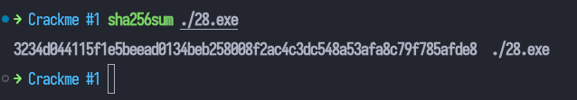
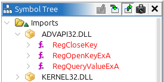
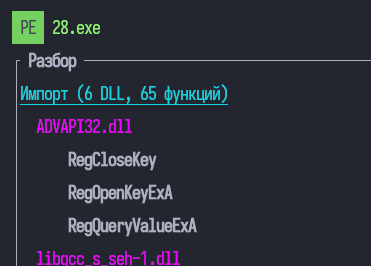
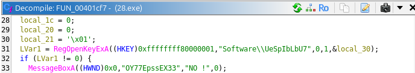
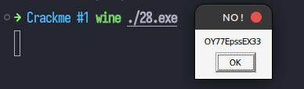
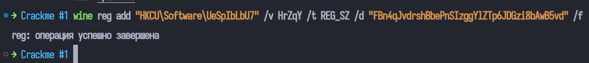
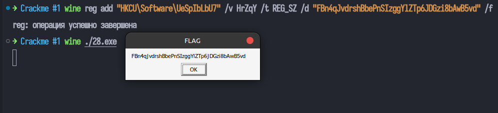

# Crackme #1 — 28.exe — Анализ

Чтобы не прыгать от windows powershell и терминала linux, запустил аналог команды получения хэша в терминале linux.


## Импортируемые функции (ADVAPI32.dll)
- `RegOpenKeyExA`
- `RegQueryValueExA`
- `RegCloseKey`



Из своей программы:


## Ответы

### 1. Корневой раздел
`HKEY_CURRENT_USER` (константа `0x80000001`)

### 2. Подключ
`Software\UeSpIbLbU7`



### 3. Параметр подключа
`HrZqY`

### 4. Что произойдёт, если подключ не найден
Вызов `RegOpenKeyExA` вернёт ненулевой код ошибки.
Программа покажет `MessageBoxA` с текстом **"OY77EpssEX33"** и заголовком **"NO !"**,
после чего вызовет `ExitProcess(0)`.


### 5. Значение параметра, при котором выводится FLAG
Регистровое значение `HrZqY` типа `REG_SZ` должно содержать строку:

```
FBn4qJvdrshBbePnSIzggYlZTp6JDGzi8bAwB5vd
```

Зададим ключ в реестре:


Результат повторного запуска:


### 6. Зачем RegQueryValueExA вызывается дважды
- **1-й вызов**: параметр `lpData = NULL` — функция не читает данные,
  а только возвращает в `lpcbData` необходимый размер буфера.
- **2-й вызов**: после выделения буфера (`operator_new__(size)`)
  фактически читает данные значения в этот буфер.

Это стандартный Windows API:  узнать размер, потом прочитать.
