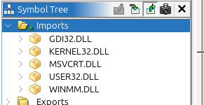
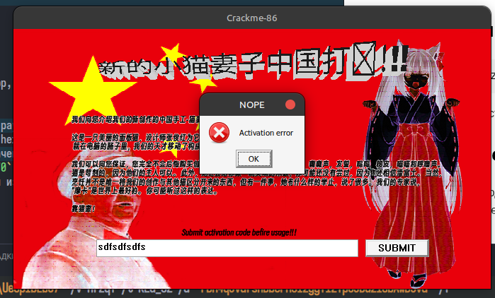
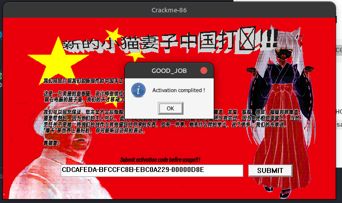

# Crackme #2 — 28.exe — Анализ

## Описание
GUI-приложение "Crackme-86". Серийный номер проверяется в функции `FUN_004017bd`.
Строки в бинарнике обфусцированы XOR-алгоритмом (функции `FUN_004016fd`, `FUN_00401764`, `FUN_004016ad`).
ADVAPI32/Registry не используются.

## Импортируемые DLL

- `GDI32.dll`
- `KERNEL32.dll`
- `MSVCRT.dll`
- `USER32.dll`
- `WINMM.dll`

При вводе случайной строки показывает ошибку активации:


## Формат серийного номера
```
XXXXXXXX-YYYYYYYY-ZZZZZZZZ-NNNNNNNN
```
Четыре группы по 8 шестнадцатеричных цифр, разделённые `-`.

## Алгоритм проверки
1. Строки в .rdata декодируются через 7 раундов XOR-операций.
2. Последний раунд декодирует 5-байтный hex-ключ → `uVar10 = 0x9c6`.
3. Из серийника парсятся 4 32-битных значения: `v6, v7, v8, v9 (= кол-во итераций)`.
4. Если `v9 != 0`, запускается `v9 = 3470` итераций преобразования над `v6, v7, v8`.
5. Результаты сравниваются с константами из `.data`:
   - `uVar6 == 0xDBC77991`
   - `uVar7 == 0xB6DD4B40`
   - `uVar8 == 0x1DB1057D`
   - `uVar9 == 0x00000D8E` (3470)

## Правильный серийный номер
```
CDCAFEDA-BFCCFC8B-EBC0A229-00000D8E
```



## Итог
- При вводе правильного серийника: `MessageBoxA` → "Activation complited !" ("GOOD_JOB")
- При неверном: `MessageBoxA` → "Activation error" ("NOPE")
